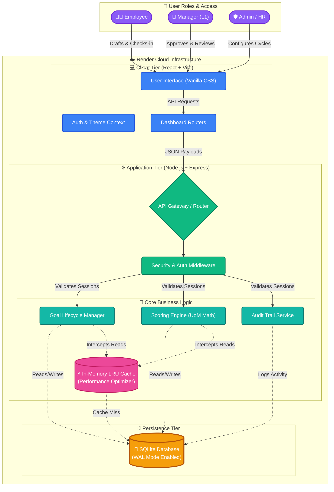

# 🏗️ AtomQuest Portal Architecture

Our architecture is designed for **blazing-fast performance**, **zero managed-database costs**, and **high scalability**. Below is the complete system topography, mapping the user journey from the browser down to our cost-optimized data layer.

### 🧠 Architectural Highlights for the Evaluation Panel:

1. **Zero External DB Cost:** By utilizing **SQLite in WAL (Write-Ahead Logging) mode**, we achieve high-concurrency read/write operations locally without the overhead or recurring cost of an external database like RDS or MongoDB.
2. **Lightning Fast Analytics:** The custom **In-Memory LRU Cache** (`cache.js`) intercepts heavy dashboard queries, delivering millisecond response times and protecting the database from read-spikes during quarter-end check-in rushes.
3. **Monolithic Efficiency:** Hosted as a monolithic web service on **Render**, eliminating complex microservice orchestration while maintaining logical separation of concerns internally (UI, API, Services, DB). 
4. **Secure Access Control:** The `Auth & Role Middleware` sits at the top of the application tier, ensuring that Employees, Managers, and Admins are strictly gated from each other's data endpoints.
